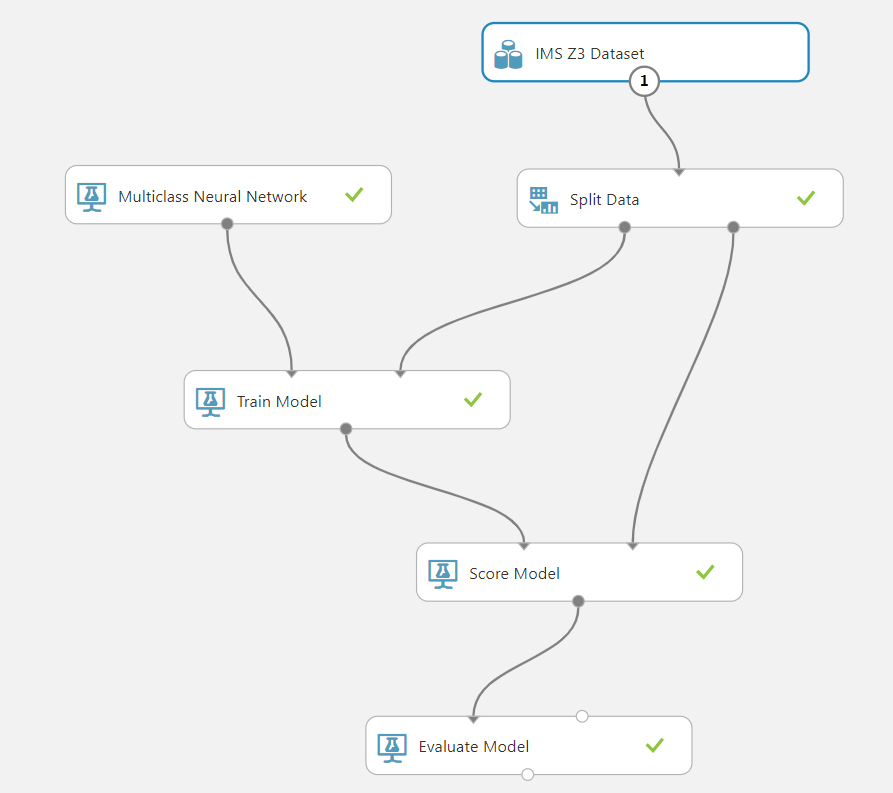

# Zadanie c.2 - vyuzitie Azure ML
## Schéma Azure ML
Na predikciu bola vybraná *MLP (Multilayer Perceptron)*. Klientská aplikácia bola vytvorená v *Xamarin.Forms*.

## Schéma Azure Webservice

## Xamarin.Forms Aplikácia
 